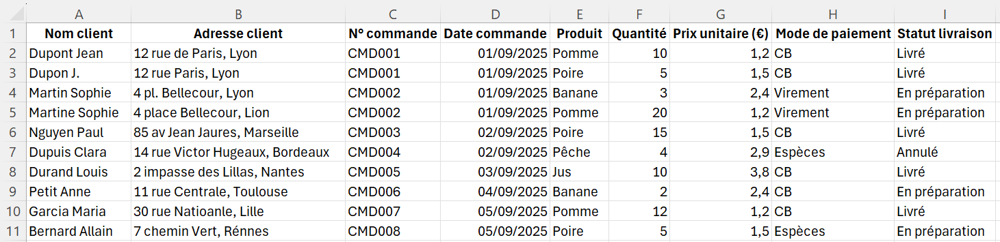
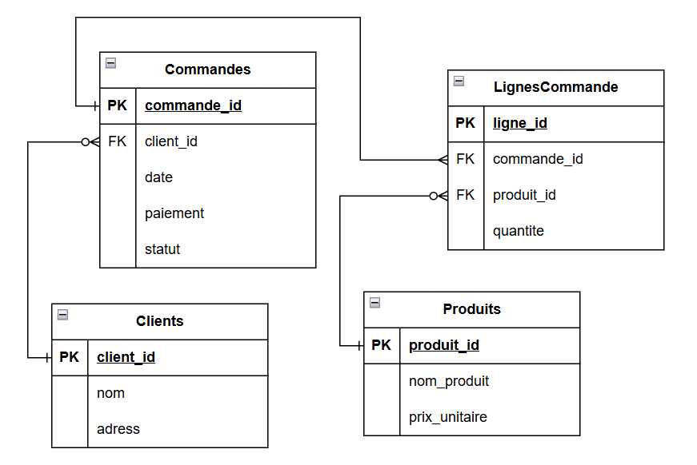

# Concepts clés
## Les tableurs

Beaucoup d’organisations commencent avec un tableur. C’est intuitif : on saisit des données, on fait des calculs, on trie, on filtre, on partage un fichier. Pour de petites tâches ou des analyses ponctuelles, c'est très efficace.

Mais dès que les données deviennent nombreuses, partagées ou évolutives, les limites apparaissent vite.




### Limites d’un tableur

- **Redondance** : l’adresse client, le mode de paiement, etc. sont répétés à chaque ligne → sources d’erreurs.
- **Difficulté de mise à jour** : si l’adresse de Dupont change, il faut corriger toutes les lignes.
- **Incohérences** : le même client peut apparaître avec des noms différents (Dupont Jean / Dupon J.), des adresses mal orthographiées (Lyon / Lion), ou des données contradictoires.
- **Pas de structure claire** : commandes et produits sont mélangés dans la même table.
- **Pas de clés primaires/étrangères** : impossible d’assurer l’unicité et la cohérence des relations entre clients, commandes et produits.
- **Pas de gestion fine des accès** : si deux personnes modifient le fichier en même temps, les versions peuvent entrer en conflit.
- **Pas de vraie gouvernance** : peu de contrôle sur les droits, les validations, les sauvegardes.


C’est précisément pour dépasser ces limites que l’on utilise des bases de données relationnelles et des Systèmes de Gestion de Bases de Données (SGBD).


---

## Qu’est-ce qu’une base de données ?

Une base de données est une **organisation logique et durable** d’informations. 
Son objectif est de permettre de **stocker**, **retrouver**, **mettre à jour**, **partager** et **protéger** ces informations à mesure que l’activité grandit. 
Contrairement à un simple fichier, une base de données impose un **schéma** (quelles colonnes, quels types de données, quelles règles) et fait respecter des **contraintes** (unicité, non-nullité, domaines de valeurs). 
Elle supporte l’accès **concurrent** de plusieurs utilisateurs, gère des **volumes croissants** et garantit la **persistance**.


---

## Bases de données relationnelles (SQL)

Les bases de données relationnelles sont parmi les plus utilisées aujourd’hui.  

Le **modèle relationnel** représente les données sous forme de **tables** (appelées aussi relations).  
- Chaque **ligne** d’une table est un **enregistrement** (ou tuple), c’est-à-dire une instance concrète.  
- Chaque **colonne** est un **attribut**, c’est-à-dire une propriété décrivant les enregistrements.  
- Chaque table possède une **clé primaire (PK)**, qui identifie de façon unique ses lignes.  
- Les **clés étrangères (FK)** permettent de créer des **relations** entre les tables.  

Ainsi, une base de données relationnelle n’est pas une seule grande table comme dans un tableur, mais un ensemble de tables liées entre elles.  

---

### Exemple de tables relationnelles

#### Table `Clients`

| client_id (PK) | nom            | adresse                    |
|----------------|----------------|----------------------------|
| 1              | Dupont Jean    | 12 rue de Paris, Lyon      |
| 2              | Martin Sophie  | 4 place Bellecour, Lyon    |
| 3              | Nguyen Paul    | 85 av. Jean Jaurès, Marseille |

---

#### Table `Produits`

| produit_id (PK) | nom_produit | prix_unitaire |
|-----------------|-------------|---------------|
| 201             | Pomme       | 1,20          |
| 202             | Poire       | 1,50          |
| 203             | Banane      | 2,40          |
| 204             | Pêche       | 2,90          |
| 205             | Jus         | 3,80          |

---

#### Table `Commandes`

| commande_id (PK) | client_id (FK) | date       | paiement  | statut         |
|------------------|----------------|------------|-----------|----------------|
| 101              | 1              | 2025-09-01 | CB        | Livré          |
| 102              | 2              | 2025-09-01 | Virement  | En préparation |
| 103              | 3              | 2025-09-02 | CB        | Livré          |

---

#### Table `LignesCommande`

| ligne_id (PK) | commande_id (FK) | produit_id (FK) | quantite |
|---------------|------------------|-----------------|----------|
| 1001          | 101              | 201             | 10       |
| 1002          | 101              | 202             | 5        |
| 1003          | 102              | 203             | 3        |
| 1004          | 102              | 201             | 20       |
| 1005          | 103              | 202             | 15       |

---

### Comment lire cet exemple ?


- Dans la table **Clients**, chaque enregistrement est identifié par `client_id`. 
- `client_id`, `nom`, `adresse` sont les **Attributs** de la table **Clients**
- `client_id` est la **clé primaire** de la table **Clients**
- La table **Produits** répertorie les articles disponibles avec leur prix de référence, identifiés par `produit_id`.  
- La table **Commandes** relie une commande à un client grâce à la **clé étrangère** `client_id`.  
- La table **LignesCommande** relie chaque ligne à une commande (`commande_id`) et à un produit (`produit_id`).

---

Ces tables peuvent être mises sous forme de schema




---

## Exercice : du tableur aux tables relationnelles

Ce fichier Excel [prets_bibliotheque_tableur.xlsx]({{ '/datasets/prets_bibliotheque_tableur.xlsx' | relative_url }}) contient toutes les informations d’une bibliothèque.  

**Objectif :** transformer ce fichier « plat » en plusieurs tables relationnelles.  

### Étapes attendues
1. Identifier les entités principales  
2. Créer une table pour chaque entité avec une **clé primaire (PK)**.  
3. (Bonus) Déterminer les **clés étrangères (FK)** permettant de relier les tables.

---

## Qu’est-ce qu’un SGBD ?

Une base de données ne “tourne” pas seule. Il faut un moteur qui la crée, la maintienne, exécute les requêtes, gère la sécurité, l’optimisation, les logs et la concurrence. Ce moteur est le **Système de Gestion de Base de Données** (**SGBD**). Il sert d’interface entre les données et leurs utilisateurs (humains ou applications).


Exemples : MySQL, PostgreSQL, SQL Server et Oracle pour le relationnel ; MongoDB (documents), Redis (clé-valeur), Neo4j (graphes) côté NoSQL.

---

## Différence entre un SGBD et un SGBDR

**SGBD** est le terme générique pour désigner le moteur. **SGBDR** (Système de Gestion de Base de Données **Relationnelles**) désigne un SGBD qui implémente le **modèle relationnel** : données en tables, clés primaires et étrangères, contraintes, transactions ACID, et **SQL** comme langue commune.

- Un **SGBDR** organise les entités en **tables** reliées par des **clés**, impose des **contraintes** d’intégrité et expose **SQL**.
- Un **SGBD non relationnel** peut stocker des **documents** JSON (flexibles), des **paires clé-valeur** (caches ultra-rapides), des **graphes** (relations profondes), etc. Cela offre de la souplesse, mais confie souvent à l’application la responsabilité de la cohérence.


---


## Le Langage SQL
Le SQL (Structured Query Language) est un langage déclaratif et standardisé.
Il permet de :
- décrire la structure d’une base relationnelle
- manipuler les données
- interroger les données
- gérer les transactions
- contrôler les accès


On distingue trois grandes familles de commandes SQL.


### Définir la structure (DDL)
Le **Data Definition Language** sert à créer/faire évoluer tables, contraintes, index, vues et schémas.

```sql
CREATE TABLE Clients (
  client_id  SERIAL PRIMARY KEY,
  nom        VARCHAR(100) NOT NULL,
  adresse    VARCHAR(255) NOT NULL
);
```

### Manipuler les données (DML)
Le **Data Manipulation Language** couvre l’insertion, la mise à jour et la suppression.
```sql
INSERT INTO Clients (nom, adresse)
VALUES ('Alice Dupont', '10 rue Victor Hugo, Paris');

UPDATE Clients
SET adresse = '15 rue de Lyon, Paris'
WHERE client_id = 1;

DELETE FROM Clients
WHERE client_id = 999;
```

### Interroger l’information (DQL)
Le **Data Query Language** s’articule autour de SELECT. On filtre, on joint, on agrège, on ordonne, on regroupe.
```sql
SELECT p.produit_id, p.nom_produit, SUM(lc.quantite) AS qte_vendue
FROM LignesCommande lc
JOIN Commandes c ON c.commande_id = lc.commande_id
JOIN Produits p  ON p.produit_id  = lc.produit_id
WHERE date_trunc('month', c.date) = date_trunc('month', CURRENT_DATE)
GROUP BY p.produit_id, p.nom_produit
ORDER BY qte_vendue DESC
LIMIT 5;
```


