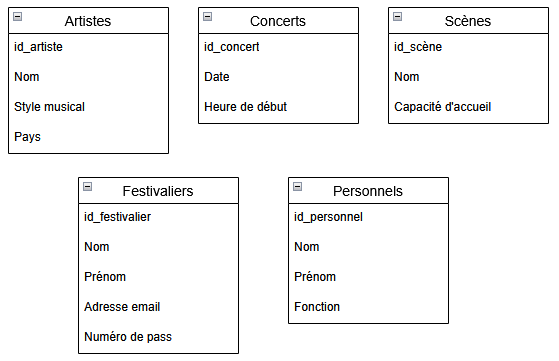

# De la modélisation à la conception d’une base de données

## Introduction
Créer une base de données ne se limite pas à « stocker des informations ». C’est un travail de conception, comparable à la construction d’une maison : avant de poser les briques, il faut dessiner des plans. Ces plans assurent que la maison sera solide, adaptée aux besoins, et évolutive.  

En informatique, ces plans correspondent à la **modélisation**. Ils décrivent les informations à gérer et leurs relations avant d’écrire la moindre ligne de code SQL.  

En France, une méthode a largement structuré cette démarche : la méthodologie **Merise** . Elle sépare données et traitements, et s’appuie sur trois niveaux :  
- **Conceptuel (MCD – modèle conceptuel de données)** : représentation indépendante de la technique.  
- **Logique (MLD – modèle logique des données)** : traduction vers le modèle relationnel.  
- **Physique (MPD – modèle physique des données)** : passage au SQL concret.  

Nous allons suivre tout au long du cours un exemple fil rouge : un **festival de musique**.

---

## Les règles de gestion métier
Avant de se lancer dans la création d’un modèle conceptuel de données (MCD), il faut d’abord comprendre le **besoin métier**.  
Ces besoins sont formalisés sous forme de **règles de gestion**, qui décrivent quelles informations doivent être stockées et comment elles s’articulent entre elles.  

Ces règles peuvent être :  
- fournies par les futurs utilisateurs,  
- ou établies par le concepteur lui-même après des entretiens, des observations et une analyse du domaine.  

En tant que développeur ou concepteur, il est essentiel de savoir poser les bonnes questions :  
- Quelles informations doivent être mémorisées ?  
- Quels objets doivent être reliés entre eux ?  
- Quelles contraintes particulières faut-il respecter ?  

---

## Le modèle conceptuel de données (MCD)
Le **MCD** est la première étape de la modélisation. Son but est de représenter le domaine d’étude sous une forme conceptuelle, c’est-à-dire sans se soucier des contraintes techniques. On cherche avant tout à décrire les objets du monde réel que l’on veut gérer et les relations qu’ils entretiennent entre eux.  

Deux notions sont fondamentales dans un MCD : les **entités** et les **associations**.

### Les entités
Une entité est un ensemble homogène d’objets du monde réel. Chaque objet de cet ensemble est appelé une **occurrence** de l’entité.  

Dans notre festival, on identifie les entités suivantes :  
- **Artistes** : chaque musicien ou groupe programmé au festival. Attributs : nom, style musical, pays d’origine.  
- **Scènes** : lieux physiques où se déroulent les concerts. Attributs : nom, capacité d’accueil.  
- **Concerts** : chaque événement programmé (un ou plusieurs artistes sur une scène à un horaire donné). Attributs : date, heure de début.  
- **Festivaliers** : spectateurs assistant au festival. Attributs : nom, prénom, adresse e-mail, numéro de pass.  
- **Personnel** : personnes travaillant pour l’organisation (techniciens, bénévoles, agents de sécurité). Attributs : nom, fonction.  

Chaque entité doit être identifiée de manière unique grâce à un **identifiant**. Dans la plupart des cas, on utilise un entier auto-incrémenté, qui sera la clé primaire dans le modèle relationnel.

---

### Les associations
Une **association** établit un lien sémantique entre deux ou plusieurs entités. Elle se nomme généralement avec un verbe, à la forme active (jouer, assister, travailler) ou à la forme passive (être programmé sur).  
Une association peut, si nécessaire, posséder ses propres attributs, qui décrivent spécifiquement la relation.  

Dans notre festival, on peut identifier les associations suivantes :  
- **Programmer (Concerts ↔ Scènes)** : un concert est programmé sur une scène.  
- **Jouer (Artistes ↔ Concerts)** : un artiste joue lors d’un concert. Attributs possibles : ordre de passage, durée prévue.  
- **Assister à (Festivaliers ↔ Concerts)** : un festivalier assiste à un concert. Attributs possibles : type de billet, date d’achat.  
- **Travailler sur (Personnel ↔ Concerts)** : un membre du personnel travaille sur un concert. Attributs possibles : rôle, horaire de prise de poste.  

---

### Les cardinalités
Les **cardinalités** précisent combien de fois une occurrence d’une entité peut participer à une association. Elles se notent sous la forme (min, max).  

Dans le festival :  
- **Programmer** : Un concert est programmé sur une et une seule scène (cardinalité (1,1) côté Concerts) et une scène peut accueillir un ou plusieurs concerts (cardinalité (0,N) côté Scènes).
- **Jouer** : Un artiste peut jouer dans un ou plusieurs concerts (0,N) et un concert accueille un ou plusieurs artistes (1,N)  
- **Assister à** : Un festivalier peut assister à un ou plusieurs concerts (0,N) et un concert peut accueillir zéro, un ou plusieurs festivaliers (0,N).
- **Travailler sur** : Un membre du personnel peut travailler sur zéro, un ou plusieurs concerts (0,N) et un concert mobilise au moins une personne, mais souvent plusieurs (1,N).
 

Les cardinalités traduisent directement les règles métier. Elles doivent être discutées et validées avec les utilisateurs du système.  

---

### Cas particuliers

#### Association réflexive
Une **association réflexive** relie une entité à elle-même : les occurrences de la même entité entretiennent entre elles un lien spécifique.  
Exemple dans le festival : l’entité **Personnel** reliée à elle-même par l’association **Superviser**.  
- Un membre du personnel peut superviser 0, 1 ou plusieurs autres membres (0,N).  
- Un membre du personnel peut être supervisé par au maximum un seul autre membre (0,1).  

Cela permet de représenter une hiérarchie interne : un chef de sécurité supervise plusieurs agents, mais chaque agent n’a qu’un seul supérieur direct.  

---

#### Association plurielle
Les **associations plurielles** apparaissent lorsqu’une même paire d’entités est reliée par plusieurs associations distinctes, chacune traduisant un rôle différent.  

Exemple classique : une **agence immobilière**. Les entités **Personnes** et **Logements** sont reliées par trois associations :  
- **Posséder** : une personne peut posséder 0, 1 ou plusieurs logements, tandis qu’un logement appartient toujours à une seule personne.  
- **Résider principalement** : une personne peut avoir au maximum un logement principal, tandis qu’un logement peut être la résidence principale de 0, 1 ou plusieurs personnes.  
- **Résider secondairement** : une personne peut disposer de plusieurs résidences secondaires, et un logement peut être utilisé comme résidence secondaire par plusieurs personnes.  

---

### Exercice – Salle de sport
Voici les règles de gestion métier que vous avez actuellement en votre possession :
- Une salle de sport propose plusieurs **cours** collectifs comme le yoga, le pilates, le crossfit ou encore des cours de self défense.  
- Chaque cours se déroule dans un **espace dédié** (salle de yoga, salle de musculation, espace extérieur, zone de tatami).  
- Les cours sont encadrés par des **coach sportifs**. On souhaite mémoriser leur nom, prénom et leur date d’arrivée dans le club.  
- Les **membres** assistent aux cours. Pour chaque membre, on enregistre : numéro d’adhésion, nom, prénom, adresse e-mail, date d’enregistrement et formule choisie (abonnement mensuel, annuel, cours individuels uniquement).  
- Chaque cours est planifié sur un ou plusieurs **créneaux horaires** (date, heure de début, durée).  
- On aimerait pouvoir savoir qui a participé réellement à un créneau (présence effective), ce qui peut différer des inscriptions prévues.

Identifiez les **entités**, les **associations** ainsi que les **cardinalités** nécessaire à l'établissement du MCD et réalisez celui-ci.
